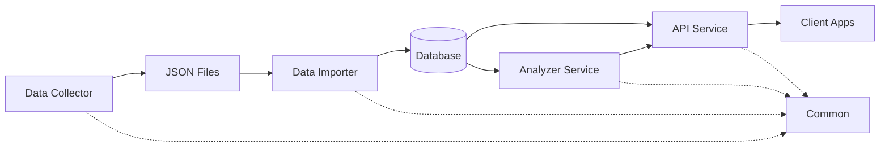

# Services 目錄

台股資料系統微服務架構，包含四個主要服務和共用程式庫。

## 🏗️ 微服務架構

```
services/
├── data-collector/         # 資料收集服務
├── data-importer/          # 資料匯入服務
├── api-service/            # REST API 服務
├── analyzer-service/       # 分析與回測服務
├── common/                 # 共用程式庫
└── README.md               # 本文件
```

## 📊 服務概覽

### 1. Data Collector (資料收集服務)

**職責**: 從證交所與櫃買中心收集各類台股資料

**功能**:
- 每日價量資料收集
- 三大法人買賣超
- 融資融券資料
- 借券賣出資料
- 成交量前 20 名

**執行方式**: 單次執行或排程執行
**技術**: Python, Requests, Pandas
**文檔**: [data-collector/README.md](data-collector/README.md)

### 2. Data Importer (資料匯入服務)

**職責**: 將 JSON 格式資料匯入資料庫

**功能**:
- JSON 資料解析與驗證
- 批次資料匯入
- 資料轉換與正規化
- 匯入狀態追蹤

**執行方式**: 單次執行或排程執行
**技術**: Python, PostgreSQL, SQLAlchemy
**文檔**: [data-importer/README.md](data-importer/README.md)

### 3. API Service (REST API 服務)

**職責**: 提供 RESTful API 查詢股票資料

**功能**:
- 股票基本資料查詢
- 歷史價格查詢
- 三大法人資料查詢
- 技術指標計算
- 籌碼分析

**執行方式**: 長期運行服務
**技術**: FastAPI, PostgreSQL, Redis
**埠號**: 8000
**文檔**: [api-service/README.md](api-service/README.md)

### 4. Analyzer Service (分析服務)

**職責**: 技術分析、籌碼分析與策略回測

**功能**:
- 技術指標批次計算
- 籌碼分析
- 選股策略執行
- 策略回測
- 風險指標計算

**執行方式**: 單次執行或背景任務
**技術**: Python, TA-Lib, Pandas, NumPy
**文檔**: [analyzer-service/README.md](analyzer-service/README.md)

### 5. Common Library (共用程式庫)

**職責**: 提供所有服務共用的工具與模型

**內容**:
- 工具函式 (日期、檔案、日誌)
- 資料模型定義
- 資料驗證器
- 資料源 API 封裝

**文檔**: [common/README.md](common/README.md)

## 🔄 服務間關係



### 資料流程

1. **Data Collector** 從官方 API 收集資料，儲存為 JSON
2. **Data Importer** 讀取 JSON 檔案，匯入資料庫
3. **API Service** 從資料庫讀取資料，提供 REST API
4. **Analyzer Service** 從資料庫讀取資料，進行分析計算
5. 所有服務共用 **Common Library** 的工具函式

## 🚀 快速開始

### 使用 Docker Compose

```bash
# 啟動所有服務
docker-compose up -d

# 查看服務狀態
docker-compose ps

# 查看日誌
docker-compose logs -f

# 停止所有服務
docker-compose down
```

### 單獨啟動服務

```bash
# Data Collector
cd services/data-collector
python app/main.py --date 2024-12-27

# Data Importer
cd services/data-importer
python app/main.py --date 2024-12-27

# API Service
cd services/api-service
uvicorn app.main:app --reload

# Analyzer Service
cd services/analyzer-service
python app/main.py --stock-id 2330
```

## 🔧 開發指南

### 新增服務

1. 在 `services/` 建立新目錄
2. 建立 `app/` 和 `tests/` 子目錄
3. 建立 `README.md`、`requirements.txt`、`Dockerfile`
4. 實作服務邏輯
5. 在 `build/` 建立 Dockerfile
6. 更新 `docker-compose.yml`

### 共用程式庫

修改 `services/common/` 中的程式碼會影響所有服務：

- 新增工具函式 → `common/utils/`
- 新增資料模型 → `common/models/`
- 新增驗證器 → `common/validators/`
- 新增資料源 → `common/datasources/`

### 測試

```bash
# 執行單一服務測試
cd services/data-collector
pytest tests/

# 執行所有測試
pytest services/*/tests/
```

## 📦 部署

### 本地部署

```bash
# 建置所有映像檔
./build/build-all.sh

# 使用 deployment 腳本
cd deployment
./deploy.sh
```

### 生產部署

```bash
# 使用 Docker Compose
docker-compose -f docker-compose.prod.yml up -d

# 使用 Kubernetes
kubectl apply -f k8s/
```

## 🔐 環境變數

每個服務都支援以下環境變數：

### 通用變數

- `LOG_LEVEL` - 日誌等級 (DEBUG, INFO, WARNING, ERROR)
- `TZ` - 時區 (預設: Asia/Taipei)

### Data Importer & API Service

- `DATABASE_URL` - 資料庫連線字串
- `REDIS_URL` - Redis 連線字串 (選用)

### API Service

- `SECRET_KEY` - JWT 簽章金鑰
- `API_PORT` - API 服務埠號 (預設: 8000)
- `CORS_ORIGINS` - 允許的 CORS 來源

## 📊 效能監控

### 健康檢查

```bash
# API Service
curl http://localhost:8000/health

# 其他服務
docker ps --filter name=tw-stock
```

### 日誌收集

```bash
# 查看所有服務日誌
docker-compose logs -f

# 查看特定服務
docker-compose logs -f data-collector
```

### 資源使用

```bash
# 查看 Docker 資源使用
docker stats

# 查看資料庫大小
docker exec -it postgres-db psql -U user -d tw_stock -c "\l+"
```

## 🔗 相關文件

- [專案 README](../README.md) - 專案整體說明
- [CLAUDE.md](../CLAUDE.md) - AI 助手指南
- [Build README](../build/README.md) - Docker 建置說明
- [Deployment README](../deployment/README.md) - 部署說明

## 📝 注意事項

### 向後相容

舊的 `src/` 和 `scripts/` 目錄仍然保留，用於向後相容：

- `src/` → 保留原始程式碼
- `scripts/` → 保留生產腳本 (run_collection.py, backfill.py等)
- `dev-scripts/` → 開發測試腳本

### 遷移建議

1. 新功能開發在 `services/` 目錄下進行
2. 逐步將 `src/` 中的程式碼遷移到對應服務
3. 保持 API 介面穩定，避免破壞性變更
4. 確保舊腳本仍可正常運作

---

**維護者**: Jason Huang
**最後更新**: 2026-02-01
**架構版本**: v2.0 (微服務架構)
